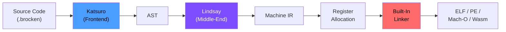
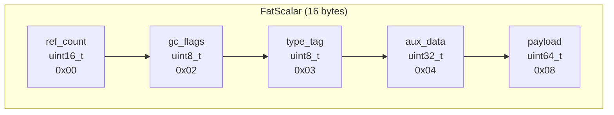
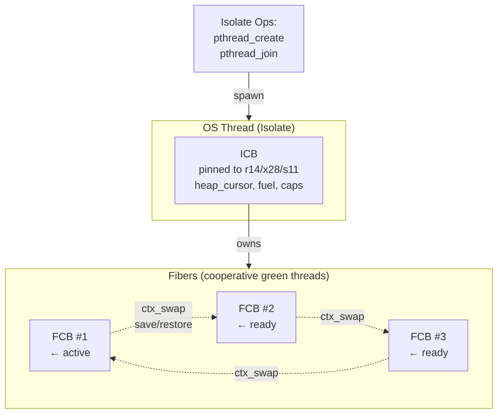
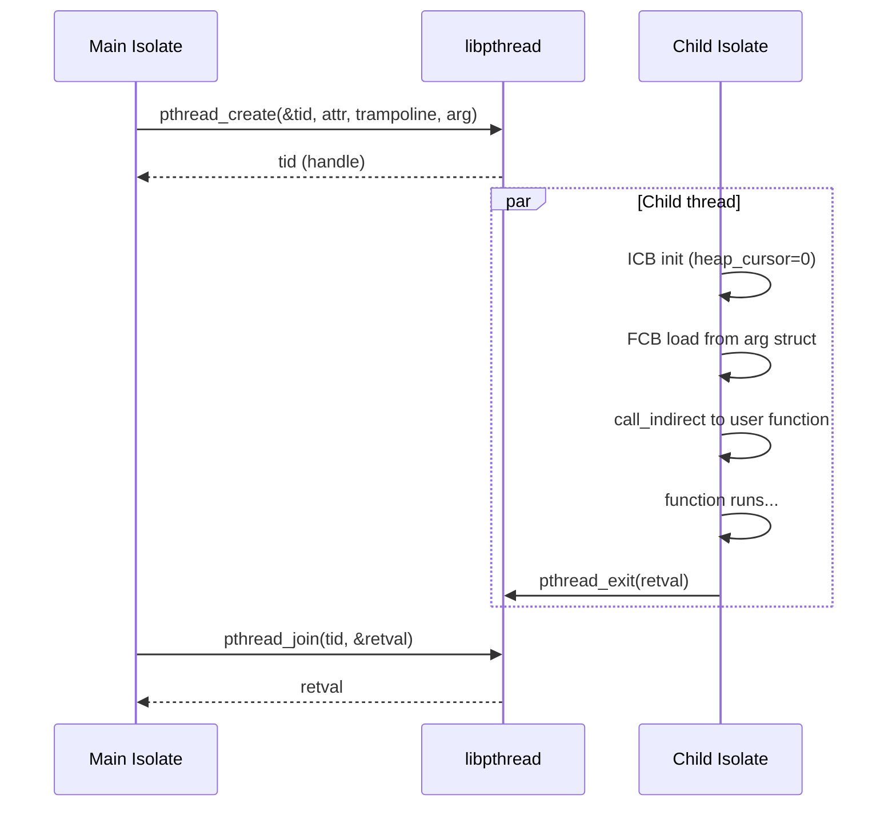
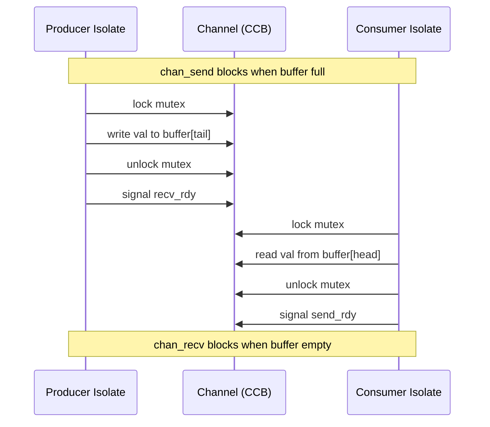
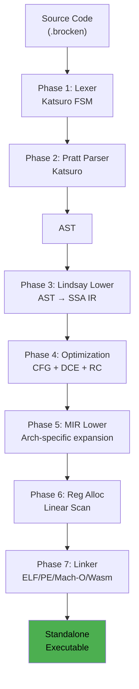

# Design Doc: Brocken Language Architecture & Runtime

**Author:** Sanko Robinson
**Date:** 2026-06-25
**Status:** Active Development

---

## Objective

Compile a modernized Perl-like syntax directly to standalone native executables (x86_64, ARM64, RISC-V, WebAssembly) with a self-hosted runtime, deterministic memory management, and CSP-style concurrency.

---

## Context & Background

Perl 5 already exists. Brocken is not a clone but a reimagining for the AOT-compiled, multicore era.

The idea for this grew out of my JIT powered FFI [Affix.pm](http://metacpan.org/dist/Affix "Affix.pm"). I wanted to move the JIT compiler out of [infix](http://github.com/sanko/infix "infix") which is written in C and into pure perl and then I wondered if I could also write the shared libs themselves in perl. I started this as a simple compiler backend (Lindsay IR → Jenny MIR → native codegen + linker); I needed to prove it could be done in a reasonable amount of time before I burned too much time on a dead end project. The frontend (Katsuro parser) and runtime (Brocken::Runtime) are being built on top of this backend. The compiler is currently written in to target Perl v5.42 and will bootstrap into self-hosting once the frontend matures.

Key milestones reached so far:
- SSA IR (Lindsay) with arithmetic, memory, control flow, box/unbox, refcounting ops
- 4 backend targets: X86_64, ARM64, RISCV64, Wasm (MVP)
- Linear-scan register allocation with spilling
- ELF64, PE (COFF), Mach-O linkers producing standalone executables and shared libraries
- Fiber (cooperative green thread) lowering + `ctx_swap` on all 4 native targets
- Isolate (OS thread) lowering via `pthread_create`/`CreateThread` on all native targets
- i128 arithmetic on all 4 targets
- Standard Wasm module emission (no runtime imports)

---

## Goals

- **AOT Compilation:** Compile Perl-like syntax directly to zero-dependency standalone native executables.
- **Self-Hosted Runtime:** The GC, fiber scheduler, I/O layers, and channel runtime are written in Brocken, using compiler intrinsics (`__syscall`, `__atomic_add`).
- **Modern Concurrency:** M:N concurrency using Fibers (green threads) multiplexed across Isolates (OS threads with independent heaps), communicating safely via Channels.
- **Memory Management:** RC Immix system - deterministic reference counting backed by a tracing cycle-detector.
- **Modernization:** UTF-8 by default, zero-cost exceptions (`try/catch/finally`), `defer` blocks, `match` statement, native SIMD via typed arrays.

## Non-Goals

- **100% bug-for-bug Perl 5 compatibility:** We will break compatibility where it conflicts with AOT compilation, safe concurrency, or modern semantics. I'm writing this for myself and not for darkpan.
- **C Library Dependency (libc):** No dependency on glibc, musl, or msvcrt for core runtime. The linker emits standalone binaries using OS syscalls directly.
- **Interpreted execution as default:** Brocken is AOT-first. JIT compilation is strictly reserved for dynamic `eval` and some regex.
- **General-purpose malloc/free:** The RC Immix allocator replaces malloc entirely.

---

## Constraints

- No libc dependency; all synchronization, memory, and I/O primitives must use raw OS syscalls or linker-resolved dynamic imports.
- Wasm backends cannot create OS threads (sandboxed); isolate/channel operations are stubs until the threads proposal stabilizes.
- Each Isolate has an independent Immix heap; no shared mutable state between OS threads.
- The compiler is currently written in Perl 5 and must eventually bootstrap into self-hosting.

---

## Proposed Architecture

Brocken is divided into three tiers:



1. **Frontend (Katsuro):** Platform ID system + recursive descent parser. Produces an AST with embedded context information.
2. **Middle-End (Lindsay):** SSA-form Intermediate Representation. High-level constructs (`defer`, `match`, channels) are lowered here into basic blocks and IR instructions. Optimization passes (constant folding, Perceus RC elision) run here.
3. **Backend (Jenny):** Machine IR lowering → register allocation → binary linking. Produces standalone `.exe`, `.so`, or ELF/Mach-O/Wasm binaries.

---

## Dependencies

### OS Primitives (per platform)

| Primitive | Linux | Windows | macOS |
|-----------|-------|---------|-------|
| Thread create | `pthread_create` | `CreateThread` | `pthread_create` |
| Thread join | `pthread_join` | `WaitForSingleObject` + `GetExitCodeThread` + `CloseHandle` | `pthread_join` |
| Dynamic linking | `dlopen`/`dlsym` | `LoadLibrary`/`GetProcAddress` | `dlopen`/`dlsym` |
| Mutex | `pthread_mutex_*` | `SRWLOCK` | `pthread_mutex_*` |
| Condvar | `pthread_cond_*` | `CONDITION_VARIABLE` | `pthread_cond_*` |
| Memory map | `mmap` (via syscall) | `VirtualAlloc` | `mmap` (via syscall) |
| Debug output | `write` (syscall) | `OutputDebugString` / `WriteFile` | `write` (syscall) |
| CPU affinity | `sched_setaffinity` | `SetThreadAffinityMask` | `pthread_setaffinity_np` |

### Linker Import Tables

Each native linker maintains a GOT with resolved import addresses:

- **ELF64:** `dlopen`, `dlsym`, `pthread_create`, `pthread_join`, `exit`, `sched_setaffinity` (+ mutex/condvar for channels)
- **MachO:** `_dlopen`, `_dlsym`, `_pthread_create`, `_pthread_join`
- **PE:** `LoadLibraryA`, `GetProcAddress`, `CreateThread`, `WaitForSingleObject`, `GetExitCodeThread`, `CloseHandle`, `ExitProcess` (+ SRWLOCK/CV for channels)

---

## Scenarios

### Scenario 1: Pipeline with channels

```perl
sub producer ($ch) : isolate {
    for my $i (0 .. 99) {
        $ch->send($i);              # blocks if channel full
    }
    $ch->close;
}

sub consumer ($ch, $log) : isolate {
    while (my $val = $ch->recv) {   # blocks until data or close
        $log->send("got: $val");
    }
}

sub main {
    my $data = Channel->new(32);    # capacity 32
    my $log  = Channel->new(16);
    async producer($data);          # spawns isolate
    async consumer($data, $log);    # spawns another isolate
    while (my $msg = $log->recv) {
        say $msg;
    }
}
```

Compiled IR:
```
%ch   = chan_create 32            # producer-consumer channel
%log  = chan_create 16            # logging channel
%p    = isolate_create @producer(%ch)
%c    = isolate_create @consumer(%ch, %log)
loop:
  %msg = chan_recv %log
  # print %msg
  jmp loop
```

### Scenario 2: Non-blocking try

```perl
sub worker ($ch, $val) : isolate {
    unless ($ch->try_send($val)) {
        # channel full — handle backpressure
        $ch->send($val);           # blocking fallback
    }
}
```

## Missing Features (v1)

These features are intentionally deferred from the v1 implementation:

### Shared-Mutable Object Transfer

Channel values are currently limited to `i64`. Transferring fat scalars (dynamic objects) across isolates requires RC ownership transfer, which depends on the Immix allocator. In v1, sending complex objects deep-copies or is rejected at compile time.

### Full ICB

The Isolate Control Block currently only has `heap_cursor` (offset 0). The complete ICB with fiber run queue, Immix cursor/limit, fuel counter, and capability mask is deferred.

### Immix Bump Allocator

All memory is currently stack-allocated via `alloca`. The 32KB-block / 256-byte-line Immix allocator with line marking and reclamation is the next major runtime component.

### Perceus RC Elision

Static analysis to cancel redundant incref/decref pairs and enable in-place mutation is deferred until the Immix allocator is stable.

### Context Tag Register

Dynamic context dispatch (void/scalar/list) via a hidden register argument is designed but not yet implemented.

### `match` / `defer` / `try/catch`

The frontend (Katsuro parser) is still being built; these language-level control flow constructs are deferred until Lindsay IR lowering for them is implemented.

### BrockenIO

The layered I/O system (VTable-based like PerlIO) is deferred. v1 binaries interact with the OS via raw syscalls or linker-resolved imports (pthreads, etc.).

### SIMD Auto-Vectorization

Block SIMD operations lowering to AVX/NEON are future work, requiring typed array support in the frontend first.

### Wasm Threading

Wasm MVP is sandboxed -- no OS threads, no shared memory. All isolate and channel operations are stubs until the Wasm threads proposal stabilizes.

---

## 1. Memory Architecture (Current)

### 1.1 Allocation

Memory allocation is currently handled in two ways:

- **Stack (`alloca`):** All local variables, fiber stacks (64KB), isolate stacks (64KB), and boxed fat scalars (16 bytes) are allocated via `alloca` in the current function's frame. This is correct for values that do not escape the allocating function.
- **ICB.heap_cursor (offset 0):** Each isolate has a heap cursor field in its ICB. It is initialized to NULL and reserved for the future Immix allocator.

### 1.2 The `Any` Type (Fat Scalar)

A dynamically typed variable (`my $x;`) is represented as a 16-byte value:



```c
// Fat Scalar: 16 bytes, fits in two 64-bit registers
struct FatScalar {
    uint16_t ref_count;   // Offset 0x00
    uint8_t  gc_flags;    // Offset 0x02: Bit0=Cycle Suspect
    uint8_t  type_tag;    // Offset 0x03: 0=Int, 1=String, ...
    uint32_t aux_data;    // Offset 0x04: type-specific (cached string length, etc.)
    uint64_t payload;     // Offset 0x08: i64/f64 or heap pointer
};
```

Currently, `box` allocates this 16-byte struct via `alloca`. The payload and tag are stored as adjacent 8-byte fields. `unbox` reads them back.

### 1.3 Refcounting (Current)

`incref` and `decref` IR instructions are lowered to calls to `Brocken::Runtime::incref` and `Brocken::Runtime::decref`. The runtime module does not yet exist — these are placeholders.

### 1.4 Immix Allocator + Perceus (Planned)

*Immix bump-allocation and Perceus RC elision are not yet implemented. See TODO.*

---

## 2. Concurrency & Execution Engine

### 2.1 The Isolate Control Block (ICB)

An Isolate is an OS thread. Its control block is a 64-byte struct pinned to a dedicated register:

| Arch | Register |
|------|----------|
| X86_64 | `r14` |
| ARM64 | `x28` |
| RISCV64 | `s11` |

```c
// ICB: 64 bytes, register-pinned
struct ICB {
    void*    heap_cursor;   // 0x00: Reserved for future Immix heap bump pointer
    // 0x08-0x3F: Reserved for future use (fiber run queue, sandbox state, fuel, etc.)
};
```

Only `heap_cursor` (offset 0) is currently initialized. The full ICB with `current_fcb`, `fiber_head`, `immix_cursor/limit`, `fuel_ticks`, `capabilities`, etc. is planned.

### 2.2 The Fiber Control Block (FCB)

Fibers are M:N cooperative coroutines. Each has a 64KB or 128KB machine stack and a Fiber Control Block holding saved callee registers.

The FCB layout is defined implicitly by the `ctx_swap` callee-save order plus fixed-offset metadata fields.

#### X86_64 FCB (80 bytes, fiber register: `r12`)

| Offset | Field | Notes |
|--------|-------|-------|
| 0 | `rbx` | Callee-save |
| 8 | `rbp` | Callee-save |
| 16 | `self` | FCB pointer. Skip restore during ctx_swap |
| 24 | `r13` | Callee-save |
| 32 | `r14` | Callee-save (ICB reg — pass through) |
| 40 | `r15` | Callee-save |
| 48 | `saved_rsp` | Stack pointer |
| 56 | `parent` | Yielder/receiver FCB |
| 64 | `resume_pc` | Resume address |
| 72 | `os_thread` | ICB pointer |

#### ARM64 FCB (128 bytes, fiber register: `x28`)

| Offset | Field | Notes |
|--------|-------|-------|
| 0–88 | `x19`–`x30` | 12 callee-save regs (x30 = link register, zeroed for crash safety) |
| 96 | `saved_sp` | Stack pointer |
| 104 | `parent` | Yielder/receiver FCB |
| 112 | `resume_pc` | Resume address (`FCB_RESUME_OFF`) |
| 120 | `os_thread` | ICB pointer |

#### RISCV64 FCB (136 bytes, fiber register: `s11`)

| Offset | Field | Notes |
|--------|-------|-------|
| 0–96 | `s0`–`ra` | 13 callee-save regs (ra = return address, zeroed for crash safety) |
| 104 | `saved_sp` | Stack pointer |
| 112 | `parent` | Yielder/receiver FCB |
| 120 | `resume_pc` | Resume address (`FCB_RESUME_OFF`) |
| 128 | `os_thread` | ICB pointer |



### 2.3 The `ctx_swap` Mechanism

Three operations use context switching:

1. **Fiber transfer** — save current FCB, load target FCB, branch to resume_pc.
2. **Fiber yield** — save current FCB, load `parent` FCB.
3. **Isolate trampoline** — entry point called by `pthread_create` on a new OS thread. Loads FCB from arg struct, sets fiber register, loads args, `call_indirect` to the user function.

In all cases, the save sequence pushes callee-save registers + stack pointer + resume PC into the current FCB. The restore sequence loads them from the target FCB.

### 2.4 Fiber Ops (Current)

| IR Instruction | Lowering |
|----------------|----------|
| `fiber_create` | alloca FCB + 64KB stack, init fields, `lea_func` entry |
| `fiber_transfer` | `ctx_swap` MIR |
| `fiber_yield` | load parent from FCB, `ctx_swap` MIR |
| `fiber_id` | mov fiber register to output |
| `fiber_pin` | `sched_setaffinity` / `SetThreadAffinityMask` |

### 2.5 Isolate Ops (Current)

| IR Instruction | Lowering |
|----------------|----------|
| `isolate_create` | alloca FCB (80/128/136) + ICB (64) + arg struct, `pthread_create` / `CreateThread` |
| `isolate_join` | `pthread_join` / `WaitForSingleObject` + `GetExitCodeThread` + `CloseHandle` |

**Wasm:** Both are stubs (return `i64_const 0`). Thread creation is not supported in Wasm MVP.



---

## 3. Channels & Cross-Isolate Communication (Interfaces Specification)

### 3.1 Overview

Channels provide CSP-style communication between Isolates (and Fibers). They are bounded ring buffers protected by a mutex + condition variable. Values sent are currently limited to `i64`; transferable objects (fat scalars with RC ownership transfer) are future work.



### 3.2 Channel Data Structure

Channels are allocated from a fixed global table (up to 256 channels, each with a fixed-size ring buffer). The channel handle is an index into this table.

```c
// Channel Control Block (CCB): inline in global table
struct Channel {
    // Platform synchronization
    //   Unix:    pthread_mutex_t lock; pthread_cond_t send_rdy; pthread_cond_t recv_rdy;
    //   Windows: SRWLOCK lock; CONDITION_VARIABLE send_rdy; CONDITION_VARIABLE recv_rdy;
    uint32_t capacity;     // Max elements
    uint32_t count;        // Current elements
    uint32_t head;         // Dequeue index
    uint32_t tail;         // Enqueue index
    uint32_t closed;       // 1 if closed
    int64_t  buffer[];     // Ring buffer: capacity * 8 bytes
};
```

The global table lives in the `.data` section of the executable. On Unix, mutex+condvar are initialized to `PTHREAD_MUTEX_INITIALIZER` / `PTHREAD_COND_INITIALIZER`. On Windows, SRWLOCK and CONDITION_VARIABLE are initialized with `InitializeSRWLock` / `InitializeConditionVariable` at startup.

### 3.3 IR Instructions

#### `chan_create`

```
%ch = chan_create $capacity
```

| Field | Value |
|-------|-------|
| Opcode | `chan_create` |
| Return type | `i64` (channel handle, 0 on failure) |
| Operands | `$capacity`: `i64` constant |
| Semantics | Scans the global channel table for a free slot, initializes the mutex and condvar, sets capacity, returns the slot index. |

**Lowering (native):**
1. Load global channel table base address
2. Loop over slots looking for one with `closed == 1` (or uninitialized sentinel)
3. If found, zero-fill the slot, store capacity, init mutex + condvar (linker imports)
4. On Windows: call `InitializeSRWLock`, `InitializeConditionVariable`
5. Return slot index (or 0 if table full)

**Lowering (Wasm):**
```
i64_const 0   # stub
```

#### `chan_send`

```
chan_send %ch, %val
```

| Field | Value |
|-------|-------|
| Opcode | `chan_send` |
| Return type | `void` |
| Operands | `%ch`: `i64` handle, `%val`: `i64` value |
| Semantics | If the channel is full and not closed, blocks until space is available. Writes `%val` to the ring buffer tail and advances the tail index. |

**Lowering (native, pseudocode):**
```
// lock mutex
mov  rdi, %ch.addr
call pthread_mutex_lock       // linker import

// while full and not closed, wait
.loop:
  load  count
  load  capacity
  cmp   count, capacity
  jl    .have_space
  load  closed
  jnz   .have_space            // if closed, send succeeds (will be dropped)
  // wait: pthread_cond_wait(&send_rdy, &lock)
  mov   rdi, %ch.addr + cond_offset
  mov   rsi, %ch.addr
  call  pthread_cond_wait
  jmp   .loop

.have_space:
  // write to buffer[tail]
  load  tail
  store buffer[tail], %val
  tail = (tail + 1) % capacity
  count++
  store tail, count

  // unlock + signal
  mov   rdi, %ch.addr
  call  pthread_mutex_unlock
  mov   rdi, %ch.addr + recv_cond_offset
  call  pthread_cond_signal
```

**Lowering (Wasm):**
```
nop   # stub
```

#### `chan_recv`

```
%val = chan_recv %ch
```

| Field | Value |
|-------|-------|
| Opcode | `chan_recv` |
| Return type | `i64` (received value, or 0 if closed and empty) |
| Operands | `%ch`: `i64` handle |
| Semantics | If the channel is empty and open, blocks. Reads from the ring buffer head. Returns 0 if closed and drained. |

**Lowering (native, pseudocode):**
```
// lock + wait while empty + not closed
.lock:
  call  pthread_mutex_lock
.loop:
  load  count
  cmp   count, 0
  jg    .have_data
  load  closed
  jnz   .closed                // closed and empty → return 0
  call  pthread_cond_wait
  jmp   .loop

.have_data:
  load  head
  %val = load buffer[head]
  head = (head + 1) % capacity
  count--
  store head, count

  call  pthread_mutex_unlock
  call  pthread_cond_signal    // wake a blocked sender

.closed:
  call  pthread_mutex_unlock
  %val = 0
```

**Lowering (Wasm):**
```
i64_const 0   # stub
```

#### `chan_close`

```
chan_close %ch
```

| Field | Value |
|-------|-------|
| Opcode | `chan_close` |
| Return type | `void` |
| Operands | `%ch`: `i64` handle |
| Semantics | Sets the closed flag and broadcasts to all waiters. Subsequent sends to a closed channel succeed (value is discarded). Recv returns 0 once drained. |

**Lowering (native):**
```
call  pthread_mutex_lock
store closed, 1
call  pthread_mutex_unlock
call  pthread_cond_broadcast   // send_rdy
call  pthread_cond_broadcast   // recv_rdy
```

#### `chan_try_send` (non-blocking)

```
%ok = chan_try_send %ch, %val
```

| Field | Value |
|-------|-------|
| Opcode | `chan_try_send` |
| Return type | `i1` (1 if sent, 0 if full) |
| Operands | `%ch`: `i64` handle, `%val`: `i64` value |
| Semantics | Non-blocking. Returns 0 immediately if channel is full. |

#### `chan_try_recv` (non-blocking)

```
%val, %ok = chan_try_recv %ch
```

| Field | Value |
|-------|-------|
| Opcode | `chan_try_recv` |
| Return type | `(i64, i1)` — value + success flag (multi-return) |
| Operands | `%ch`: `i64` handle |
| Semantics | Non-blocking. Returns `(0, 0)` immediately if empty. |

### 3.4 Linker Import Additions

Each native linker must resolve the following additional symbols:

**ELF64 (+ MachO):**
```
pthread_mutex_lock
pthread_mutex_unlock
pthread_cond_wait
pthread_cond_signal
pthread_cond_broadcast
```

**PE (Windows):**
```
InitializeSRWLock
AcquireSRWLockExclusive
ReleaseSRWLockExclusive
InitializeConditionVariable
SleepConditionVariableSRW
WakeConditionVariable
WakeAllConditionVariable
```

GOT slot layout is updated per linker to accommodate the new imports.

### 3.5 Channel Handle Representation

A channel handle is an `i64` value: `(index << 32) | generation`. The generation counter prevents use-after-free races. A handle of 0 is invalid (reserved for allocation failure).

### 3.6 Wasm Stubs

On Wasm, all channel operations are stubs:
- `chan_create` → `i64_const 0` (no channels available)
- `chan_send` → `nop`
- `chan_recv` → `i64_const 0`
- `chan_close` → `nop`
- `chan_try_send` → `i32_const 0` (always fails)
- `chan_try_recv` → `i32_const 0; i64_const 0` (always fails)

---

## 4. Compilation Pipeline



### Phase 1: Katsuro Lexical Analysis
Finite-state machine tokenizer. (Not yet implemented — current test code writes IR directly.)

### Phase 2: Katsuro Context-Aware Pratt Parser
Recursive descent parser maintaining a context state stack (Scalar vs List vs Void). (Not yet implemented.)

### Phase 3: Lindsay Lowering (AST → SSA IR)
The AST is lowered into Lindsay IR (SSA form). Control flow is flattened into blocks connected by `cond_br` and `jmp`. `defer` nodes are stored in a compiler stack and cloned into scope exits.

### Phase 4: Lindsay Optimization
- Constant folding
- Dead code elimination
- **`map`/`grep` loop fusion:** Adjacent `map` or `grep` chains are merged into a single pass over the list, eliminating intermediate allocations. `map { f($_) } map { g($_) }` lowers to a single loop calling `g(f($_))`.
- Perceus RC elision (planned, see TODO)

### Phase 5: Jenny MIR Lowering
Architecture-agnostic Lindsay IR is lowered to architecture-specific Machine IR. Intrinsic expansion (`Brocken::ptr_add` → `add`), ABI register mapping, channel op expansion into mutex/condvar sequences.

### Phase 6: Linear Scan Register Allocation
Liveness intervals → physical register assignment. Spill slots allocated in the stack frame.

### Phase 7: Built-In Linker

Produces ELF64, PE (COFF), or Mach-O binary. Resolves imports via GOT, performs cross-function call fixups, emits section layout.

#### Debug Symbols

The linker emits DWARF v5 `.debug_info` sections. Level is set by the `--debug` flag:

| Level | `--debug` | Behaviour |
|-------|-----------|-----------|
| 0 | (default) | No debug sections emitted |
| 1 | `-g1` | Enable all debug sections (`.debug_info`, `.debug_line`, `.debug_abbrev`) |
| 2 | `-g2` | Include full class/struct type DIEs in `.debug_info` (member offsets, base types, template params) |

---

## 5. Security & Sandboxing Architecture

### 5.1 ICB-Pinned Sandboxing

Because the ICB is pinned to a hardware register (`r14`/`x28`/`s11`), sandbox state checks are a single load + test — no memory indirection penalty.

### 5.2 Fuel Injection (Planned)

Fuel is an `i64` at ICB offset 0x30. The compiler inserts fuel decrement instructions at loop back-edges and function entries. When fuel reaches 0, a hard abort is triggered.

*Not yet implemented. See TODO.*

### 5.3 Capability Masking (Planned)

A `capabilities` bitmask at ICB offset 0x48 is checked before syscall intrinsics. Bits: `CAP_FS_READ`, `CAP_FS_WRITE`, `CAP_NET`, etc.

*Not yet implemented. See TODO.*

### 5.4 Host Bindings (`bind` API)

Currently no implementation exists. The planned design:
1. Guest calls a Gate Function
2. Arguments are deep-copied from Guest's Immix heap to Host's heap
3. ICB register is swapped to Host ICB
4. Host closure executes
5. Return value is deep-copied back

---

## 6. Modern Perl Semantics

### 6.1 Context (Planned)

A hidden `__context_tag` register communicates the calling context (Void, Scalar, List, Typed) to dynamically-dispatched functions. This replaces Perl 5's `wantarray`.

Constant mapping (not yet finalized):
- `0` = Void
- `1` = Scalar
- `2` = List
- `3` = `Int`
- `4` = `String`

The `want` keyword lowers to `icmp eq %__context_tag, N`.

*Not yet implemented. See TODO.*

### 6.2 `match` Statement

`match` lowers to a sequence of type-tag checks + conditional branches + unbox operations. (Not yet implemented — the parser/frontend is still being built.)

### 6.3 `defer` Blocks

Deferred code is cloned into all scope exit paths during Lindsay lowering. Zero runtime overhead (no stack of defer frames). (Not yet implemented.)

### 6.4 `try/catch/finally` (Planned)

Uses DWARF `.eh_frame` for zero-cost exception unwinding. The `die` intrinsic unwinds to the nearest `catch` landing pad.

### 6.5 Pod6 Documentation

Raku-style Pod6 is built natively into the parser. Two forms:

**Declarator blocks** — attached to the subsequent definition via `#|`:
```perl
#| Creates a new User with the given name and age.
#| Dies if age is negative.
sub create_user ($name, $age) { ... }
```

**Paragraph blocks** — standalone `=begin` / `=end` sections:
```perl
=begin pod

=head1 NAME

Brocken::Runtime::Channel — Cross-isolate message queue

=head1 SYNOPSIS

    my $ch = Channel.new(32);
    $ch.send(42);
    say $ch.recv;   # 42

=head1 DESCRIPTION

Channels provide CSP-style communication backed by a mutex+condvar
ring buffer. See C<docs/brief.md> for the full design.

=end pod
```

Pod6 nodes are attached directly to the AST as metadata on each `Brocken::Katsuro::Node`. The compiler exposes them via:

- **LSP server:** Hover tooltips, go-to-definition documentation, completion documentation
- **`bkn doc` CLI:** Extracts Pod6 from source or compiled `.bkc` files, renders as HTML/man/terminal

---

## 7. BrockenIO (Planned)

I/O is handled in user-space via layered `IOLayer` vtables (inspired by PerlIO). A filehandle holds a stack of layers (`:raw`, `:gzip`, `:utf8`). Read/write calls cascade down the stack.

The base `:raw` layer uses the `__syscall` compiler intrinsic directly — no libc wrapper.

*Not yet implemented.*

---

## 8. Gradual Typing & SIMD (Planned)

### 8.1 Standard Array

A standard Perl array (`my @arr`) stores pointers to Fat Scalars. Dynamic typing, full RC.

### 8.2 Typed Arrays

`my f32 @arr` stores contiguous `f32` values — no type tag per element, single RC for the array. Direct SIMD vectorization.

### 8.3 Auto-Vectorization

Block SIMD operations lower to AVX (x86_64) or NEON (ARM64) instructions via the codegen.

*Not yet implemented. See TODO.*

---

## 9. Ecosystem & Tooling

### 9.1 The `bkn` CLI

A unified command-line tool for the entire Brocken workflow:

| Command | Purpose |
|---------|---------|
| `bkn build` | Compile source to binary (ELF/PE/Mach-O/Wasm) |
| `bkn test` | Run tests in TAP mode (see §9.5) |
| `bkn doc` | Extract Pod6 docs, render as HTML/man/terminal |
| `bkn run` | Compile + execute immediately |
| `bkn fmt` | Auto-format source code (see §9.4) |
| `bkn deps` | Dependency management (see §9.2) |
| `bkn new` | Scaffold a new project |

The CLI is implemented in Brocken itself (self-hosting once the frontend matures).

### 9.2 Reproducible Builds & Dependency Management

Dependencies are tracked via a project-local `brocken.lock` file (JSON), not a system-wide install:

```json
{
    "version": 1,
    "deps": {
        "JSON::Class": {
            "source": "https://modules.brocken.io/JSON-Class-1.2.3.tar.gz",
            "hash": "sha256-47DEQpj8HBSa+/TImW+5JCeuQeRkm5NMpJWZG3hSuFU=",
            "provides": ["JSON::Class", "JSON::Class::Role::Serializable"]
        }
    }
}
```

- **Global cache** (`~/.brocken/cache/`): Stores downloaded source tarballs keyed by content hash.
- **Project lock** (`brocken.lock`): Pins exact versions and hashes for all transitive dependencies.
- **No system-wide install:** Each project is self-contained. No equivalent of `cpan -i` or Perl's site lib.
- **Vendoring:** `bkn deps vendor` copies all locked dependencies into a `vendor/` directory for air-gapped builds.

### 9.3 Sandboxed Build Scripts

Some Brocken projects wrap C libraries (e.g., linking `libsqlite3`). The `build.bkn` script executes inside a Wasm-based capability sandbox:

```
build.bkn execution scope:
  ✓ Read-only access to source tree
  ✓ Write access to build/ output directory
  ✓ Network access (restricted to allowlisted URLs)
  ✗ No filesystem access outside project root
  ✗ No arbitrary syscalls
  ✗ No access to environment variables (unless explicitly declared)
```

This prevents supply-chain attacks where a compromised build script exfiltrates credentials or modifies installed tools.

### 9.4 Code Formatting (`bkn fmt`)

Built-in formatter with no configuration options (opinionated, one true style):

- 4-space indentation, no tabs
- Opening brace on the same line (K&R style)
- Spaces around binary operators
- No trailing whitespace
- One blank line between top-level definitions
- Pod6 blocks indented at paragraph level

The formatter operates on the AST, not text — it always produces valid code and never changes semantics.

### 9.5 Native Unit Testing

Brocken embeds its testing framework in the compiler. Running `bkn --test file.brocken` produces TAP (Test Anything Protocol) output, pipeable to any `prove`-compatible harness.

#### Directives

| Directive | Signature | Behaviour |
|-----------|-----------|-----------|
| `plan` | `plan(Int)` | Declares expected test count |
| `ok` | `ok(Bool, Str)` | Passes if true |
| `is` | `is($a, $b, Str)` | Passes if `$a eq $b` or `$a == $b` |
| `isa_ok` | `isa_ok($obj, Str)` | Passes if object matches type |
| `fail` | `fail(Str)` | Unconditional failure |
| `subtest` | `subtest(Str, Sub)` | Groups tests under a named block |
| `todo` | `todo(Str)` | Marks a test as expected to fail |
| `skip` | `skip(Str)` | Bypasses a test block entirely |
| `dies` | `dies(Sub)` | Passes if the block throws |
| `bail` | `bail(Str)` | Aborts the entire suite |

#### Example

```perl
plan 3;

subtest "Math checks", ->() {
    ok(1 + 1 == 2, "Addition works");
    is(abs(-5), 5, "Absolute value");
};

my $obj = User->new();
isa_ok($obj, "User");

try {
    fail("This forces a failure");
}
```

Output (`bkn --test`):

```
1..3
# Subtest: Math checks
    ok 1 - Addition works
    ok 2 - Absolute value
    1..2
ok 3 - Subtest: Math checks
ok 4 - isa_ok
not ok 5 - This forces a failure
```

---

## Alternatives Considered

### Shared Memory + Atomics (rejected for v1)

Using shared mutable memory with atomic operations for cross-isolate communication. Rejected because:
- Violates the share-nothing safety model
- Requires lock-free data structures for correctness
- No clear path to transferable objects with RC
- Hard to audit for data races
- Wasm threads proposal is not yet stable

### Actor Model (mailboxes) (rejected for v1)

Each Isolate has a mailbox; only the owner can receive. Rejected because:
- Channels are more composable (select over multiple sources, fan-out patterns)
- Channels provide natural backpressure (bounded capacity)
- Multiple receivers are useful for worker pools
- Channels map well to the planned virtual actor routing

### Rust-style `mpsc` channels (rejected for v1)

Single-consumer channels are simpler but less flexible. Rejected because we want multiple receivers (worker pools, broadcast patterns).

### Wasmtime-fiber for isolates (rejected)

Using `wasmtime_fiber::Fiber` for cooperative isolation was considered but rejected because:
- Fibers don't provide parallelism (no OS thread creation)
- Blurs the fiber/isolate abstraction in Brocken's model
- Would require significant Wasmtime embedding code

---

## Open Issues

1. **Parsing Perl's Grammar AOT:** Perl prototypes alter subsequent parsing rules. Resolution: enforce a strict multi-pass analysis or slight syntactic strictness.

2. **Cross-Isolate Deep Copies:** When sending a complex dynamic object over a channel, do we deep-copy the entire tree or enforce reference capabilities for zero-copy? Resolution deferred until transferable objects are implemented.

3. **Channel Slot Reuse:** The global channel table with generation counters prevents use-after-free but doesn't handle the case where a channel is closed and its slots must be drained before the slot can be recycled. Resolution: add a `drained` flag that is set when `count == 0 && closed`.

4. **Channel Table Size:** 256 channels × 256 slots × 8 bytes = 512KB for the data alone. Acceptable for v1 but may need dynamic allocation in the future.

---

## TODO / Future Work

- **Immix Bump Allocator:** 32KB blocks, 256-byte lines, line marking + reclamation
- **Perceus RC Elision:** Static analysis to cancel redundant incref/decref pairs, in-place reuse when refcount==1
- **Context Tag (`__context_tag`):** Hidden register argument for dynamic context dispatch
- **Fuel System:** Fuel counter in ICB, decrement on loops/calls, hard abort at 0
- **SIMD Vectorization:** `vload`/`vstore` IR, AVX/NEON lowering
- **Frontend (Katsuro Parser):** Lexer + Pratt parser + AST
- **`match` / `defer` / `try/catch` lowering:** In Lindsay IR
- **BrockenIO:** Layered stream VTable system
- **Transferable Objects:** RC ownership move across channels (instead of deep copy)
- **Wasm Isolate/Channel:** Real implementation when threads proposal stabilizes
- **Self-Hosting:** Compile the Brocken compiler with Brocken

---

## Timeline

| Milestone | Target | Status |
|-----------|--------|--------|
| Lindsay IR + Jenny MIR | Done | ✅ |
| X86_64 codegen + linker | Done | ✅ |
| ARM64 codegen + linker | Done | ✅ |
| RISCV64 codegen + linker | Done | ✅ |
| Wasm codegen + linker | Done | ✅ |
| Regalloc + spilling | Done | ✅ |
| Fibers + ctx_swap | Done | ✅ |
| i128 arithmetic | Done | ✅ |
| Isolates (pthread/CreateThread) | Done | ✅ |
| Channels (mutex/condvar) | **Next** | 🚧 |
| Immix allocator + ICB expansion | After channels | 📝 |
| Perceus RC elision | After allocator | 📝 |
| Frontend (Katsuro parser) | Parallel track | 📝 |
| Self-hosting bootstrap | Q4 2026 | 📝 |
| Transferable objects | After allocator + RC | 📝 |
| SIMD auto-vectorization | Future | 📝 |
| Wasm threading | Spec dependent | 🔮 |

---

## Glossary

| Term | Definition |
|------|------------|
| **Isolate** | An OS thread with its own independent heap and GC. No shared mutable state between isolates. |
| **Fiber** | A cooperative green thread within an isolate. Fibers share the isolate's heap and are scheduled via explicit `ctx_swap`. |
| **FCB** | Fiber Control Block -- per-fiber struct holding saved callee registers, stack pointer, resume PC, and metadata. |
| **ICB** | Isolate Control Block -- per-isolate struct pinned to a dedicated register (r14/x28/s11). Holds heap cursor, fiber queue, sandbox state. |
| **CCB** | Channel Control Block -- shared ring buffer with mutex/condvar for cross-isolate message passing. |
| **Fat Scalar** | 16-byte dynamic value representation: refcount + gc_flags + type_tag + aux_data (4 bytes) + payload (8 bytes). |
| **Immix** | Bump-pointer allocator using 32KB blocks divided into 256-byte lines. Mark-region tracing for cycle collection. |
| **Perceus** | Compile-time RC optimization that cancels redundant incref/decref pairs and enables in-place mutation when refcount == 1. |
| **MIR** | Machine IR -- the post-lowering, architecture-specific instruction representation used by the codegen. |
| **ctx_swap** | MIR instruction that saves current register state to the active FCB and restores a target FCB's state. |
| **Lindsay** | The middle-end SSA IR. Architecture-agnostic, in static single-assignment form. |
| **Jenny** | The backend -- MIR lowering, register allocation, and binary linking. |
| **Katsuro** | The frontend -- platform abstraction, lexer, parser, AST. |
